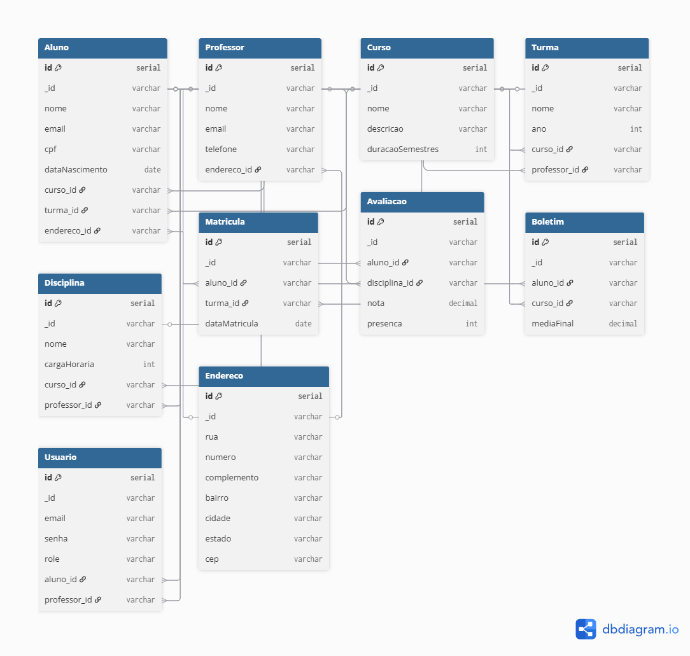

                       SchoolManager API — Sistema de Gestão Escolar

# DESCRIÇÃO GERAL DO PROJETO
A SchoolManager API é uma aplicação backend desenvolvida para gerenciar operações essenciais de um ambiente escolar, incluindo alunos, professores, cursos, turmas, disciplinas, matrículas, avaliações, boletins, usuários do sistema e endereços.

O objetivo é fornecer um sistema robusto, seguro e escalável, utilizando Node.js, Express, MongoDB Atlas e Mongoose, contemplando 10 CRUDs completos, validações, autenticação e documentação de uso.

# TECNOLOGIAS UTILIZADAS
-Node.js
-Express.js
-MongoDB Atlas
-Mongoose
-Yup (validações)
-bcryptjs (hash de senha)
-JSON Web Token (JWT)
-Postman (testes de API)
-Git e GitHub (controle de versão)

# DESCRIÇÃO DO SISTEMA
A API permite o gerenciamento completo de uma instituição de ensino, incluindo:

-Cadastro de cursos e turmas
-Matrícula de alunos
-Atribuição de professores
-Registro de avaliações
-Emissão de boletins
-Autenticação de usuários (alunos/professores)
-Relacionamento entre coleções como: Curso ↔ Turma ↔ Aluno ↔ Avaliação ↔ Boletim

O sistema segue o padrão REST, retornando respostas JSON claras e padronizadas.

# FUNCIONALIDADES IMPLEMENTADAS
CRUDs completos:
-Cursos
-Endereços
-Professores
-Disciplinas
-Turmas
-Alunos
-Matrículas
-Avaliações
-Boletins
-Usuários (com login)

Outras funcionalidades:
-Autenticação com JWT
-Validações com Yup
-Relacionamentos entre coleções via Mongoose
-Controle de acesso
-Estrutura modular de controllers, models, routes e validations

# ENDPOINTS DA API
ALUNOS: 
    GET — listar alunos: GET /alunos
    POST — criar aluno: POST /alunos
{
  "nome": "Carlos da Silva",
  "email": "carlos@escola.com",
  "cpf": "12345678901",
  "dataNascimento": "2005-02-15",
  "curso_id": "<cursoId>",
  "turma_id": "<turmaId>",
  "endereco_id": "<endId>"
}
    PUT — atualizar aluno: PUT /alunos/:id
    DELETE — excluir aluno: DELETE /alunos/:id

PROFESSORES: 
GET /professores  
POST /professores  
PUT /professores/:id  
DELETE /professores/:id 

CURSOS: 
GET /cursos  
POST /cursos  
PUT /cursos/:id  
DELETE /cursos/:id  

DISCIPLINAS: 
GET /disciplinas  
POST /disciplinas  
PUT /disciplinas/:id  
DELETE /disciplinas/:id  

ENDEREÇOS: 
GET /endereco 
POST /endereco  
PUT /endereco/:id  
DELETE /endereco/:id  

TURMAS: 
GET /turmas  
POST /turmas  
PUT /turmas/:id  
DELETE /turmas/:id  

MATRÍCULAS:
GET /matriculas  
POST /matriculas  
DELETE /matriculas/:id  

AVALIAÇÕES: 
GET /avaliacoes  
POST /avaliacoes  
PUT /avaliacoes/:id  
DELETE /avaliacoes/:id  

BOLETINS: 
GET /boletins  
POST /boletins  
PUT /boletins/:id  
DELETE /boletins/:id  

USUÁRIOS: 
POST /usuarios  
POST /usuarios/login  

# DIAGRAMA DE MODELAGEM: 

# COLLECTIONS E RELACIONAMENTOS: 
ALUNO: 
    pertence a um Curso
    pertence a uma Turma
    possui um Endereço
    possui várias Avaliações
    possui um Boletim

PROFESSOR: 
    ministra uma ou mais Disciplinas
    pode coordenar Turmas

CURSO: 
    possui várias Turmas
    possui várias Disciplinas

TURMA: 
    possui Alunos
    possui um Professor responsável

DISCIPLINA: 
    pertence a um Curso
    é ministrada por um Professor

MATRÍCULA: 
    relaciona Aluno → Turma

AVALIAÇÃO: 
    relaciona Aluno → Disciplina

BOLETIM: 
    relaciona Aluno → Curso

USUÁRIO: 
- representa a conta de acesso no sistema (login)
- campos típicos: email, senha (hash), role (admin / professor / aluno)

- pode referenciar:
    -um Aluno (aluno_id → Aluno._id) — quando a conta pertence a aluno
    -um Professor (professor_id → Professor._id) — quando a conta pertence a professor 

- usado para autenticação (JWT) e controle de permissões

ENDEREÇO: 
- usado por Aluno e Professor (Aluno.endereco_id, Professor.endereco_id)
- campos: rua, numero, complemento, cidade, estado, cep

# INSTALAÇÃO, CONFIGURAÇÃO E EXECUÇÃO
1. Clonar o repositório:
    git clone https://github.com/seuUsuario/schoolmanager-api.git
    cd schoolmanager-api

2. Instalar dependências: 
    npm install
    npm install express mongoose dotenv yup
    npm install nodemon
    npm install bcryptjs

3. Criar o arquivo .env: 
    MONGO_URI=sua_string_do_mongo_atlas
    MONGO_DBNAME=schoolmanager
    PORT=3000
    JWT_SECRET=chave_secreta
    JWT_EXPIRATION=1d

4. Rodar o servidor:
    npm start

# COMUNICAÇÃO COM O BANCO DE DADOS: 
    - Conexão feita em src/config/database.js 
    - Usa mongoose.connect(process.env.MONGO_URI)
    - Usamos MongoDB Atlas
    - Models representados em src/models/
    - Dados estruturados em coleções (collections)

# INTEGRANTES DO GRUPO: 
Guilherme Almeida Siqueira	        @Guii-pixel
Alisson dos Santos Teixeira	        @Alisson10101010
Rhayner de Paiva Oliveira Mendonça	@Rhaynerzin
Diego Sousa Leal	                @dg23nrt

# CONTRIBUIÇÕES DETALHADAS: 
Guilherme Almeida Siqueira:	
Implementação dos CRUDs: Aluno, Avaliação, Boletim
Criação do banco e testes no Atlas
Parte da documentação
Issues resolvidas: #1, #3, #7

Alisson dos Santos Teixeira:
CRUDs: Curso, Disciplina, Endereço
Validações com Yup
Diagrama do banco
Issues resolvidas: #2, #4

Rhayner de Paiva Oliveira Mendonça:
CRUDs: Matrícula e Professor
Implementação do login com JWT
Collection do Postman
Issues resolvidas: #5, #6

Diego Sousa Leal: 
CRUDs: Turma e Usuário
Implementação do login com JWT
Collection do Postman
Issues resolvidas: #5, #6